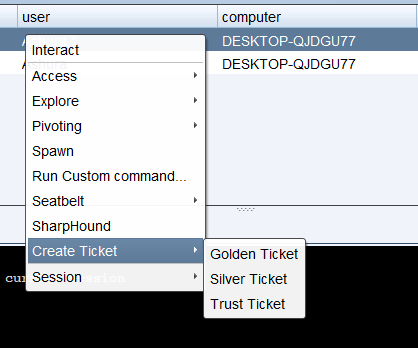
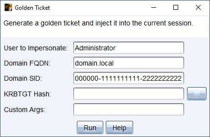
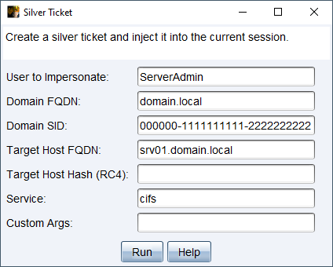
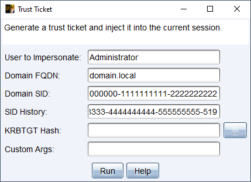
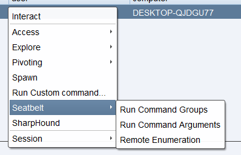
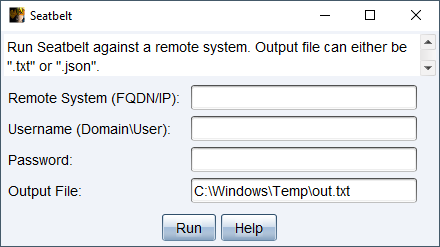
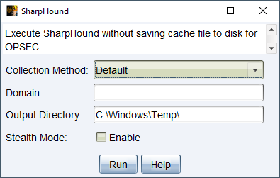

## AggressorScripts

Collection of scripts that I created to make my life easier since I'm not good at remembering command-line options and don't like typing things.

### CreateTicket.cna

- Generate golden, silver, and trust tickets from the GUI. The created tickets are then injected into the current session.
- The default settings are:
  - It uses the `/endin:600` and `/renewmax:10080` arguments to set the ticket lifetime and the maximum lifetime that a ticket can be renewed.

**Screenshots**

 

 

 

---

### Seatbelt.cna

- Run Seatbelt from the GUI.
- The default settings are:
  - It runs Seatbelt using the `-full` option to return complete results without any filtering. _(Can only be disabled by removing the `-full` string from the code.)_
  - It saves the result to `C:\Windows\Temp\out.txt`. Leaving this option **blank** won't save the result to a file.
- _**Note:** Before using, modify the value of the `$assembly` variable first and point it to the location of the Seatbelt binary._

**Screenshots**

 

---

### SharpHound.cna

- Run SharpHound from the GUI.
- The default settings are:
  - It runs using the `--NoSaveCache` option to prevent writing cache files to disk, which can help with AV and EDR evasion.
  - It saves the result to `C:\Windows\Temp\` directory. Leaving this option **blank** will save the file to the directory where SharpHound was launched from.
- _**Note:** Before using, modify the value of the `$assembly` variable first and point it to the location of the Sharphound binary._

**Screenshots**

---